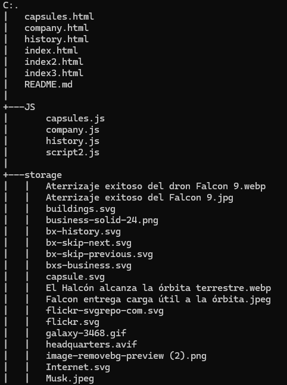
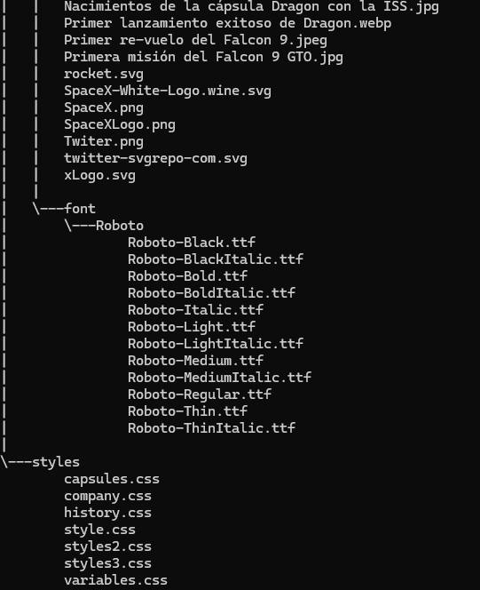

# EL COE´TE

## Descripción del proyecto 

Una empresa aeroespacial recibe licitaciones públicas con el fin de realizar investigaciones enfocadas al turismo intergaláctico de los ciudadanos del planeta tierra.

Para subir sus ingresos, quieren crear un portafolio general, el cual permita visualizar todos los servicios realizados por los cohetes disponibles en esta empresa, desde la información técnica del producto hasta las posibles misiones a realizar.

Dicho esto, el equipo de diseño UI/UX, al igual que el equipo de sistemas, diseñó y proporcionó los diferentes *wireframes* y *endpoints* necesarios para que el diseñador *FullStack* lo vuelva realidad en un aplicativo web diseñado en HTML,CSS y JavaScript

### Descripción de la empresa
*SpaceX* diseña, fabrica y lanza cohetes y naves espaciales avanzadas. La empresa se fundó en 2002 para revolucionar la tecnología espacial, con el objetivo último de que la gente pueda vivir en otros planetas.

#### Modulos del proyecto 

1. *History:* Se encuentran los eventos más importantes de la empresa, como lo son el primer lanzamiento exitoso y la primera misión comercial a la estación internacional.

2. *Rockets:* Se encuentran los datos más importantes de 4 de los cohetes que posee la empresa.

3. *Capsules:* Descripción detallada de las capsulas creadas por la empresa y información de los lanzamientos de los que hizo parte cada capsula.

4. *Company:* Se muestran los datos importantes de la empresa, como lo son valores numericos, sus líderes y los links para poder contactarlos por diferentes plataformas.

## Contenido del proyecto 

### Tecnologías utilizadas

### Estructura de archivos

### API Utilizada

El proyecto utiliza la API de SpaceX para obtener datos en tiempo real sobre la historia de la compañía y sus cohetes. Las URLs de las API son:

- Historial: https://api.spacexdata.com/v4/history
- Cohetes: https://api.spacexdata.com/v4/rockets
- Compañía: https://api.spacexdata.com/v4/company
- Cápsulas: https://api.spacexdata.com/v4/capsules

### Pantallas Disponibles

- Computador 1920 x 1080 Pixeles
- Iphone 14 Pro Max 430 x 932 Pixeles

### Consideraciones

- Asegúrate de tener acceso a Internet para cargar los datos de la API.
- Se recomienda utilizar un navegador moderno para garantizar la compatibilidad.

### Instrucciones

- Clonar este repositorio o descarga los archivos en tu maquina local
- Abre la carpeta del proyecto en VSC
- Con la extensión *Live Server* abre el archivo `index.html`

## Desarrolladores

Este proyecto fue desarrollado por: 

- Brayan Stiven Maldonado Ortega
- Valentina Molina

Para el proyecto de filtro de JavaScript como estudiantes de *Campuslands*